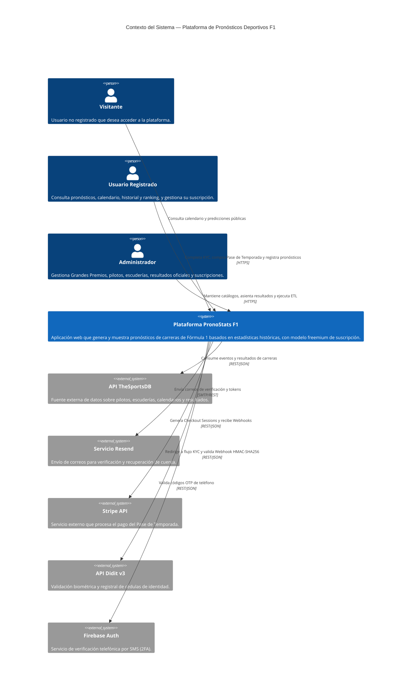
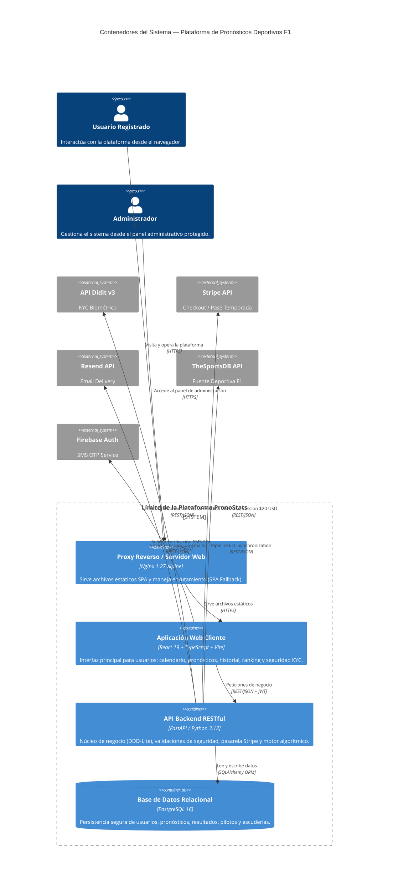
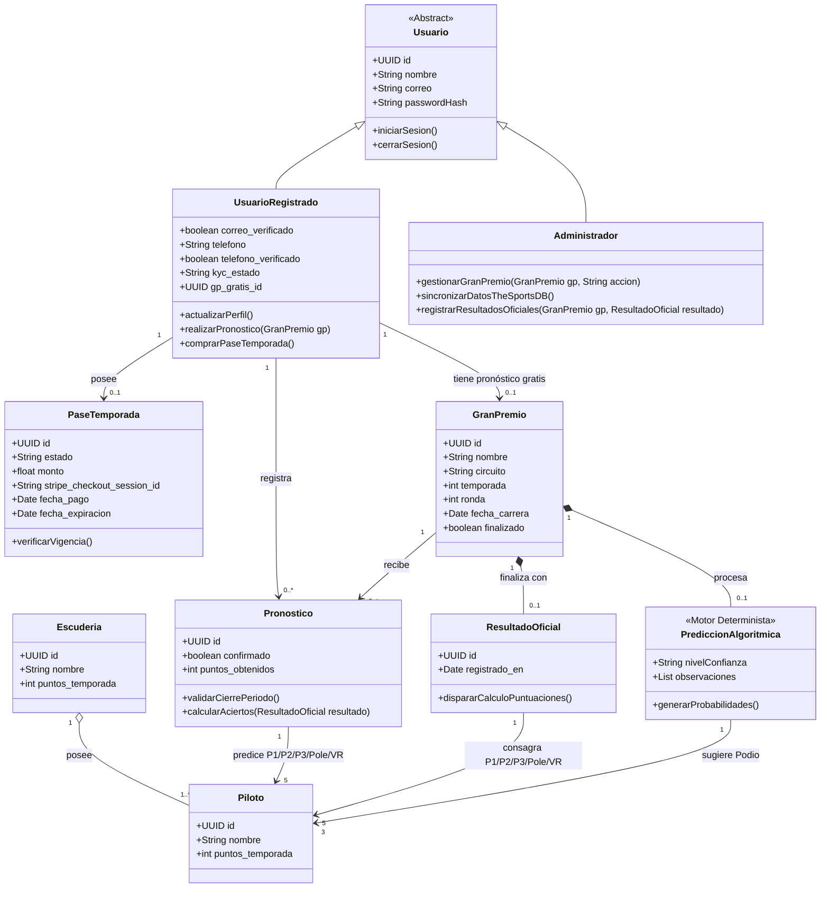

# Diagramación Arquitectónica — Plataforma de Pronósticos Deportivos F1
> Modelado como código en Mermaid.js (estilo C4: Contexto + Contenedores)

---

## Nivel 1 — Diagrama de Contexto del Sistema



---

## Nivel 2 — Diagrama de Contenedores



---

## Estructura del Proyecto

### Backend — `proyecto_f1_bcknd/`

```
proyecto_f1_bcknd/
├── docker-compose.yml
├── Dockerfile
├── requirements.txt
├── init.sql
├── .env.example
│
└── app/
    ├── main.py                    # Punto de entrada, registra todos los routers
    ├── database.py                # Conexión a PostgreSQL (SessionLocal, Base, get_db)
    ├── config.py                  # Variables de entorno centralizadas
    │
    ├── core/
    │   ├── security.py            # JWT, hash de passwords, dependencias de auth
    │   └── exceptions.py          # Excepciones HTTP reutilizables
    │
    └── modules/                   # Un paquete por épica del backlog
        ├── auth/                  # EP-01 Gestión de usuarios
        │   ├── models.py
        │   ├── schemas.py
        │   ├── crud.py
        │   └── router.py          # /auth/register, /login, /logout, /forgot-password
        │
        ├── usuarios/              # EP-02 Gestión del perfil
        │   ├── models.py
        │   ├── schemas.py
        │   ├── crud.py
        │   └── router.py          # /users/me (GET, PUT), /users/me/pronosticos, /users/me/estadisticas
        │
        ├── calendario/            # EP-03 Calendario de Grandes Premios
        │   ├── models.py          # GranPremio
        │   ├── schemas.py
        │   ├── crud.py
        │   └── router.py          # /grandes-premios
        │
        ├── pilotos/               # EP-04 (parte 1) Información de pilotos
        │   ├── models.py          # Piloto
        │   ├── schemas.py
        │   ├── crud.py
        │   └── router.py          # /pilotos, /pilotos/clasificacion
        │
        ├── escuderias/            # EP-04 (parte 2) Información de escuderías
        │   ├── models.py          # Escuderia
        │   ├── schemas.py
        │   ├── crud.py
        │   └── router.py          # /escuderias, /escuderias/clasificacion
        │
        ├── pronosticos/           # EP-05 Pronósticos de carreras
        │   ├── models.py          # Pronostico
        │   ├── schemas.py
        │   ├── crud.py
        │   └── router.py          # /pronosticos (CRUD + confirmar)
        │
        ├── resultados/            # EP-06 Resultados y clasificación
        │   ├── models.py          # ResultadoOficial
        │   ├── schemas.py
        │   ├── crud.py
        │   └── router.py          # /grandes-premios/{id}/resultados, /ranking
        │
        └── admin/                 # EP-08 Panel de administración
            ├── schemas.py
            └── router.py          # CRUD protegido de GPs, pilotos, escuderías,
                                   # resultados oficiales, apertura/cierre de pronósticos
```

> **Nota:** EP-07 (Historial y estadísticas, HU-23 a HU-26) no tiene tablas propias — son consultas agregadas sobre `pronosticos` + `resultados_oficiales`. Sus endpoints viven en `usuarios/router.py` (`/users/me/pronosticos`, `/users/me/estadisticas`) y `resultados/router.py` (`/ranking`).

---

### Frontend — `proyecto_f1_frontend/`

```
proyecto_f1_frontend/
├── package.json
├── vite.config.ts
├── tsconfig.json
│
└── src/
    ├── main.tsx                    # Punto de entrada, monta <App />
    ├── App.tsx                     # Define las rutas (React Router)
    │
    ├── core/
    │   ├── api/
    │   │   └── axiosClient.ts      # Instancia de Axios con baseURL de la API
    │   ├── context/
    │   │   └── AuthContext.tsx     # Estado global de sesión (usuario, token)
    │   ├── hooks/
    │   │   ├── useAuth.ts
    │   │   └── useFetch.ts
    │   └── guards/
    │       ├── PrivateRoute.tsx    # Protege rutas privadas
    │       └── AdminRoute.tsx      # Protege rutas de EP-08
    │
    ├── shared/
    │   └── components/             # Navbar, Card, Button y otros componentes reutilizables
    │
    └── features/                   # Una carpeta por épica
        ├── auth/                   # EP-01
        │   ├── pages/
        │   │   ├── Login.tsx
        │   │   ├── Registro.tsx
        │   │   └── RecuperarPassword.tsx
        │   └── services/
        │       └── authService.ts
        │
        ├── perfil/                 # EP-02
        │   ├── pages/
        │   │   └── EditarPerfil.tsx
        │   └── services/
        │       └── perfilService.ts
        │
        ├── calendario/             # EP-03
        │   ├── pages/
        │   │   ├── ListaGPs.tsx
        │   │   └── DetalleGP.tsx
        │   └── services/
        │       └── calendarioService.ts
        │
        ├── competencia/            # EP-04
        │   ├── pages/
        │   │   ├── Pilotos.tsx
        │   │   └── Escuderias.tsx
        │   └── services/
        │       └── competenciaService.ts
        │
        ├── pronosticos/            # EP-05
        │   ├── pages/
        │   │   ├── FormularioPronostico.tsx
        │   │   └── ConfirmarPronostico.tsx
        │   └── services/
        │       └── pronosticosService.ts
        │
        ├── resultados/             # EP-06
        │   ├── pages/
        │   │   └── Clasificacion.tsx
        │   └── services/
        │       └── resultadosService.ts
        │
        ├── historial/              # EP-07
        │   ├── pages/
        │   │   ├── MisPronosticos.tsx
        │   │   └── Ranking.tsx
        │   └── services/
        │       └── historialService.ts
        │
        └── admin/                  # EP-08
            ├── pages/
            │   ├── GestionGPs.tsx
            │   ├── GestionPilotos.tsx
            │   ├── GestionEscuderias.tsx
            │   └── RegistrarResultados.tsx
            └── services/
                └── adminService.ts
```

---

## Mapeo Épica → Módulo backend → Módulo frontend

| Épica | Módulo backend                             | Módulo frontend (React)  |
|-------|--------------------------------------------|--------------------------|
| EP-01 | `modules/auth`                             | `features/auth`          |
| EP-02 | `modules/usuarios`                         | `features/perfil`        |
| EP-03 | `modules/calendario`                       | `features/calendario`    |
| EP-04 | `modules/pilotos, escuderias, predicciones`| `features/competencia, predicciones`   |
| EP-05 | `modules/pronosticos`                      | `features/pronosticos`   |
| EP-06 | `modules/resultados`                       | `features/resultados`    |
| EP-07 | `modules/acceso ` (Pase/Stripe)            | `features/perfil` (Checkout y Bloqueos)    |
| EP-08 | `modules/admin`  (CRUD y ETL)              | `features/admin, thesportsdb`         |

---

## Notas de diseño

| Contenedor        | Responsabilidad principal                                                        |
|-------------------|----------------------------------------------------------------------------------|
| **Web App (React)**       | UI para usuarios: pronósticos, calendario, historial, ranking (React + Vite)     |
| **Admin Panel**   | CRUD de GPs, pilotos, escuderías; cierre de pronósticos; resultados (React SPA)  |
| **API Backend**   | Toda la lógica de negocio; punto único de acceso a datos (FastAPI)               |
| **Base de Datos** | Persistencia de usuarios, pronósticos, resultados y estadísticas (PostgreSQL)    |
| **Integraciones** | Dependencia estricta de servicios SaaS (Didit, Resend, Firebase, Stripe) para escalar. |

---

### Modelo de dominio



---

## Plan de Acción e Implementación: Verificación de Seguridad, KYC y Flujo de Pagos (Costo Cero)

Para habilitar la comercialización del Pase de Temporada ($20.00 USD) y garantizar la autenticidad de los usuarios sin incurrir en costos operativos durante las fases de prototipo y producción inicial, se diseñó e implementó un flujo de seguridad multicapa de tres niveles (3FA/KYC) utilizando servicios en la nube con capas gratuitas permanentes. 

Este esquema actúa como un perímetro de seguridad estricto que previene el uso de bots, evita la creación de múltiples cuentas para explotar la función de pronóstico gratuito (`gp_gratis_id`), garantiza el cumplimiento normativo de mayoría de edad (18+) y protege la pasarela de pagos contra fraudes o contrargos.

---

### 1. Verificación de Correo Electrónico (Registro de Usuario)

* **Servicio Utilizado:** **Resend API** (Plan Developer — 3,000 correos transaccionales/mes gratis).
* **Estado del Módulo:** **✅ Implementado y Funcional en Backend y Frontend**.
* **Propósito de Ingeniería:** Validar que la dirección de correo proporcionada en el formulario de registro (`HU-01`) pertenece a un usuario real y evitar la proliferación de cuentas spammers o correos temporales efímeros.
* **Arquitectura del Flujo Técnico:**
  1. **Solicitud de Registro:** Cuando el usuario completa el formulario en la vista `Registro.tsx`, se dispara una petición `POST /auth/register` enviando las credenciales.
  2. **Generación de Token Efímero:** El backend (FastAPI) crea un registro en la tabla `codigos_verificacion` con un código aleatorio de 6 dígitos numéricos, asociándole un timestamp de expiración a los 15 minutos (`expira_en = NOW() + 15 min`).
  3. **Despacho Asíncrono:** El submódulo `app/core/email.py` compila una plantilla HTML responsiva e invoca la API de **Resend** mediante HTTP asíncrono para entregar el código en la bandeja de entrada del usuario.
  4. **Pantalla de Bloqueo:** El cliente React redirige automáticamente al usuario a la pantalla `/verificar-correo`, restringiendo la navegación hacia rutas protegidas (`<PrivateRoute>`).
  5. **Confirmación y Activación:** Al ingresar los 6 dígitos, el frontend ejecuta `POST /auth/verify-email`. El backend verifica la validez del código y que no haya expirado; al ser correcto, actualiza `correo_verificado = True` en la tabla `usuarios` y marca el código como `usado = True`.

---

### 2. Verificación Telefónica y 2FA por SMS (Gestión de Perfil)

* **Servicio Utilizado:** **Firebase Phone Auth** (Spark Plan — 10,000 SMS globales/mes gratis).
* **Estado del Módulo:** **✅ Implementado y Funcional en Backend y Frontend**.
* **Propósito de Ingeniería:** Establecer un mecanismo de autenticación de doble factor (2FA) que vincule un número de teléfono móvil físico único a cada cuenta registrada en la base de datos PostgreSQL.
* **Arquitectura del Flujo Técnico:**
  1. **Inicio del Flujo:** Desde la vista `/perfil`, el usuario ingresa su número telefónico incluyendo el código de país en formato internacional E.164 (ej. `+593991234567`).
  2. **Verificación de Boti-captcha:** El cliente React utiliza el SDK de Firebase Web para renderizar un reCAPTCHA invisible, previniendo el ataque por fuerza bruta sobre la API de SMS.
  3. **Envío del Código OTP:** Firebase despacha un SMS con un código OTP de 6 dígitos directamente al dispositivo móvil del usuario sin generar costos para la infraestructura de la plataforma.
  4. **Validación del Cliente:** El usuario ingresa el código en el modal de verificación de la interfaz; la librería de Firebase valida el código contra los servidores de Google y retorna un `idToken` de confirmación firmado criptográficamente.
  5. **Persistencia en Servidor:** El frontend envía el token de Firebase al backend mediante la ruta `POST /users/me/verificar-telefono`. El backend verifica el token de Firebase, guarda el número en la columna `telefono` y conmuta el booleano `telefono_verificado = True` en PostgreSQL.

---

### 3. Verificación de Identidad Biométrica Registral - KYC (Didit API v3)

* **Servicio Utilizado:** **Didit v3 API** (Plan Sandbox/Free — 500 verificaciones registrales/mes gratis).
* **Estado del Módulo:** **✅ Implementado y Funcional en Backend**.
* **Propósito de Ingeniería:** Autenticar la identidad legal del usuario contrastando las fotografías de su cédula de identidad ecuatoriana y una selfie biométrica con prueba de vida (*liveness test*), garantizando el cumplimiento de las normativas de la República del Ecuador sobre mayoría de edad y prevención de suplantación de identidad.
* **Arquitectura del Flujo Técnico:**
  1. **Intercepción de Estado:** En la página `/perfil`, el componente evalúa los estados de seguridad del usuario. Si `kyc_estado != 'aprobado'`, se inyecta un estado reactivo que deshabilita el botón de compra del Pase de Temporada y muestra la insignia `KYC Requerido`.
  2. **Creación de Sesión Didit:** Al hacer clic en "Verificar Identidad", el cliente solicita la apertura de una sesión enviando una petición `POST /users/me/kyc/session`.
  3. **Orquestación Backend:** El script `app/core/didit.py` realiza un request autenticado contra la API de Didit v3, creando una sesión con el vendor interno y retornando la URL del flujo seguro. El backend registra temporalmente el estado como `kyc_estado = 'pendiente'`.
  4. **Captura Biométrica:** El usuario es guiado por la interfaz segura de Didit para fotografiar el anverso y reverso de su cédula de identidad y realizar la prueba de vida facial.
  5. **Notificación Asíncrona (Webhook):** Una vez que Didit valida el documento y la biometría, envía un webhook con la decisión final hacia el endpoint `/users/webhooks/didit`.
  6. **Validación Criptográfica HMAC-SHA256:** Para evitar ataques de suplantación o manipulación de peticiones HTTP, el módulo `didit.py` intercepta la cabecera `X-Signature-V2`. Efectúa una ingeniería inversa truncando valores flotantes a enteros, genera un JSON canónico y calcula el hash **HMAC-SHA256** empleando la clave secreta compartida. Asimismo, rechaza cualquier petición con un timestamp con más de 300 segundos de diferencia para impedir ataques de repetición (*Replay Attacks*).
  7. **Aprobación de la Cuenta:** Si el hash coincide y el veredicto de Didit es exitoso, la base de datos actualiza automáticamente la columna `kyc_estado = 'aprobado'`.

---

### 4. Desbloqueo del Checkout Financiero (Stripe API)

* **Servicio Utilizado:** **Stripe Checkout SDK** (Modo Sandbox / Producción).
* **Estado del Módulo:** **✅ Implementado y Funcional en Backend y Frontend**.
* **Propósito de Ingeniería:** Garantizar que únicamente los usuarios con su perfil 100% verificado (Correo + Teléfono + KYC Aprobado) puedan acceder a la pasarela de pagos para adquirir su suscripción del Pase de Temporada ($20.00 USD / año).
* **Arquitectura del Flujo Técnico:**
  1. **Evaluación de Barreras de Seguridad:** El backend (`app/modules/acceso/dependencies.py`) expone la dependencia `verificar_requisitos_pase`. Si un usuario intenta invocar la creación de un checkout sin cumplir `correo_verificado = True`, `telefono_verificado = True` y `kyc_estado == 'aprobado'`, la API responde inmediatamente con un código de error `403 Forbidden`.
  2. **Generación de Sesión de Pago:** Al superar todas las barreras, la vista `/perfil` habilita el botón "Comprar Pase de Temporada con Stripe". El cliente invoca `POST /acceso/checkout`.
  3. **Procesamiento en Stripe:** El backend se comunica con la API de Stripe para generar una `checkout.session`, pasando el ID del usuario como metadato, y retorna la URL de redirección segura.
  4. **Confirmación y Asignación de Licencia:** Tras completar el pago, Stripe emite el webhook `checkout.session.completed`. El servidor valida la transacción y registra una nueva fila en la tabla `pases_temporada` con `estado = 'activo'`, calculando la fecha de expiración exactamente a un año calendario (`fecha_expiracion = NOW() + 1 year`).
  5. **Acceso Ilimitado:** El usuario queda habilitado para registrar pronósticos en todas las carreras del campeonato sin restricciones.

